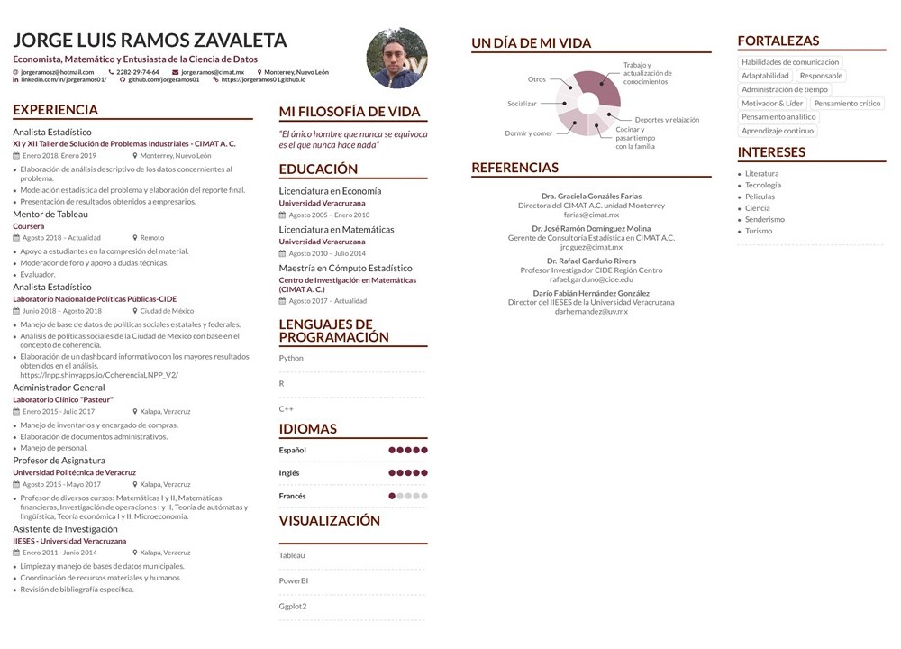

# Un poco más de mi
## Jorge Luis Ramos Zavaleta

Un poco de mi pasado y presente.
{:.lead}
{:data-width="1060" data-height="596"}
Un pequeño paseo por el parque natural de Chipinque en Nuevo León, México.
{:.figure}
<p style='text-align: justify;'>
  Soy originario de Xalapa, Veracuruz. Tengo dos licenciaturas por parte de la Universidad Veracruzana, una en Economía y otra en Matemáticas. Actualmente me encuentro en el último semestre de la maestría en cómputo estadístico del CIMAT en la ciudad de Monterrey, Nuevo León.
</p>
{:.lead}
<p style='text-align: justify;'>
Debido a mi formación adquirí un gusto por la econometría, así como por la modelación estadística en general, aunque la modelación matemática en forma de ecuaciones diferenciales y sistemas dinámicos no me es indiferente.
</p>
### Matemáticas
<p style='text-align: justify;'>
Durante mi paso por la carrera de matemáticas tuve la oportunidad de trabajar con algunos entes matemáticos conocidos como <b>super variedades</b> (super manifolds) que son generalizaciones del concepto de variedades diferenciales, que son objetos geométricos-topológicos que permiten generalizar el cálculo clásico multivariado permitiendo que se establezcan las reglas del calculo diferencial e integral en estructuras mas generales. Estas estructuras son muy importantes, tanto así que pueden ser consideradas como el lenguaje de la física moderna en la parte <b>macroscópica</b>, ya que representa de manera natural las ideas que se forman bajo la teoría de la relatividad.
</p>
<p style='text-align: justify;'>
Por otra parte las <b>super variedades</b> se desarrollaron como objetos con una estructura algebraica extra comparadas con las variedades diferenciales, lo cual permite darle una estructura de anticonmutatividad y con ello pueden representarse algunas características propias del mundo  <b>microscópico</b>, donde la parte conmutativa representa el espacio de los bosones y la anticonmutativa el espacio de los fermiones.
</p>

### Economía
<p style='text-align: justify;'>
Durante mi paso por esta carrera tuve la oportunidad de conocer varios temas macroeconómicos y microeconómicos, y también tuve la posibilidad de conocer como es que una decisión puede tener efecto directamente en otras variables, que incluso pueden parecen no estar relacionadas. Esto último se debe principalmente al concepto de <b>causalidad</b>, el cual es tal vez uno de los conceptos más importantes que tuve la oportunidad de conocer, puesto que al menos en economia se se sabe que de no atacarse las variables causales de un problema las soluciones propuestas entonces son solo paliativos temporales y completamente ineficientes.
</p>
<p style='text-align: justify;'>
La forma en que se suele enseñar economia actualmente ha permitido incorporar un enfoque más matemático-estadístico que se encuentra basado en resolver problemas de optimización con el fin de establecer la toma de decisiones óptimas. En particular, uno de los métodos base en la econometría es la <b>regresión lineal</b>, que es un instrumento muy conocido dentro de la estadística. Sin embargo, la forma en que se ha desarrollado la teoría de la regresión en economia ha permitido darle mucho más peso a la parte de causalidad mientras que en la estadística pura es generalmente aplicada simplemente como un modelo de predicción.
</p>
<p style='text-align: justify;'>
Este concepto de <b>causalidad</b> es usualmente dado por hecho por aquellos que se dedican a hacer modelos de <b>machine learning</b>, principalmente porque no tienen un conocimiento estadístico suficiente que les permita respaldar la modelación que quieren hacer, esto último incluyendo la consulta de expertos en el área en el que se quiera desarrollar el modelo, por lo que pueden terminar dando diagnósticos erróneos, y por tanto predicciones completamente equivocadas que pueden terminar costando grandes montos de dinero así como vidas en el caso de predicciones en el area médica. </p>
  
### Maestría en Cómputo Estadístico
<p style='text-align: justify;'>
Mi transición durante la maestría ha sido de lo más interesante para mi. Primero que nada tuve la oportunidad de estar en el <b>CIMAT</b> anteriormente y generalmente su enfoque esta completamente basado en un enfoque completamente teórico, pero la unidad en Monterrey se ha dedicado a hacer la labor de vinculación con las empresas privadas por lo que tienen una visión práctico-teórica y son capaces de traducir un problema industrial en una modelación estadística, computacional o matemática sin problemas, por lo que mi formación ha sido en base en este enfoque incluyendo algunas participaciones en la resolución de problemas industriales que llegan como proyectos al centro.</p>

<p style='text-align: justify;'>
Por otra parte, mis compañeros en la maestría en general provienen de diferentes carreras y oficios con lo que hemos logrado establecer y resolver problemas multi y transdiciplinarios. Así también, esto me ha permitido encontrar algunas cosas que debía subsanar para mejorar aún más, como fue el uso de la programación en paralelo o el desarrollo de software. </p>

<p style='text-align: justify;'>
Otro aspecto interesante que encontré muy placentero al trabajar durante la maestría es que se incentivaba el uso de todo tipo de datos: señales, índices, imágenes, texto, audio, video, datos georreferenciados; y se nos mostró que en general se puede tener un marco común para trabajar con todos estos tipos de datos, pero que cada una tiene su propia peculariedad y es lo que motiva la especialización en cada una de las áreas que comprende cada uno de ellos. </p>


### Curriculum Vitae
Puedes descargar una versión de mi curriculum en formato PDF [aquí](https://github.com/JorgeRamos01/jorgeramos01.github.io/blob/master/assets/Resume.pdf).

{: data-width="1867" data-height="1389"}
Una vista rapida de mi CV.
{:.figure}


### Just Markup
**Hydejack** boasts a plethora of modern JavaScript, but make no mistake: It's still a plain old *web page* at its core. It works without JavaScript, and you can even view it in a text-based browser like `w3m`:

{:data-width="1920" data-height="1260"}
The Hydejack blog, as seen by the text browser `w3m`.
{:.figure}


### Syntax Highlighting
**Hydejack** features syntax highlighting, powered by [Rouge].

```js
document.getElementsByTagName("hy-push-state")[0].addEventListener("hy-push-state-load", function() {
  // <your init code>
});
```


### Beautiful Math
They say math is beautiful — and with **Hydejack**'s [math support][latex] it's also guaranteed to *look* beautiful.

{:data-width="1060" data-height="596"}
Hydejack uses KaTeX to efficiently render math.
{:.figure}

<!-- $$
\begin{aligned}
  \phi(x,y) &= \phi \left(\sum_{i=1}^n x_ie_i, \sum_{j=1}^n y_je_j \right) \\[2em]
            &= \sum_{i=1}^n \sum_{j=1}^n x_i y_j \phi(e_i, e_j)            \\[2em]
            &= (x_1, \ldots, x_n)
               \left(\begin{array}{ccc}
                 \phi(e_1, e_1)  & \cdots & \phi(e_1, e_n) \\
                 \vdots          & \ddots & \vdots         \\
                 \phi(e_n, e_1)  & \cdots & \phi(e_n, e_n)
               \end{array}\right)
               \left(\begin{array}{c}
                 y_1    \\
                 \vdots \\
                 y_n
               \end{array}\right)
\end{aligned}
$$ -->


### Build an Audience
The PRO version has built-in support for customizable [Tinyletter] newsletter subscription boxes.

If you are using a different service like MailChimp, you can build a custom newsletter subscription box using [Custom Forms][forms].


### A Personal Site That Belongs to You
**Hydejack** is 100% built on Open Source software, and is Open Source itself, save for parts of the PRO version. The PRO version is a one-time payment that gives you the right to use it forever.


### Features
An incomplete list of features included in all versions of **Hydejack**:

* Full in-app page loading, powered by [hy-push-state]{:.external}
* Customizable sidebar and touch-enabled drawer menu, powered by [hy-drawer]{:.external}
* Lazy image loading with cancellation and placeholder, powered by [hy-img]{:.external}
* Advanced FLIP animations, inspired by Material Design
* 99/100 [Google PageSpeed Score][gpss][^2]
* [Syntax highlighting](#syntax-highlighting), powered by [Rouge]
* [LaTeX math blocks][latex], powered by [KaTeX]
* Change the wording of built-in strings and possibly translate in other languages
* Support for categories and tags
* Built-in icons for many social networks
* Simple and semantic HTML
* Structured Data for core entities
* Author section below each article and support for multiple authors
* Google Analytics and Google Fonts support
* Disqus comments


### Download
There are two versions of **Hydejack**: The *free version* includes basic blogging functionality, as did previous versions of the theme.
The *PRO version* includes additional features for professionals:
A [portfolio], a [resume] layout, and a [welcome] page to highlight your favorite projects and posts.

This table below shows what's included in each version:

|                        | Free           | PRO      |
|:-----------------------|:--------------:|:--------:|
| Blog                   | &#x2714;       | &#x2714; |
| [Features]             | &#x2714;       | &#x2714; |
| [Portfolio]            |                | &#x2714; |
| [Resume]               |                | &#x2714; |
| [Welcome]              |                | &#x2714; |
| [Newsletter Box][news] |                | &#x2714; |
| [Custom Forms][forms]  |                | &#x2714; |
| Dark Mode              |                | &#x2714; |
| Cookie Banner          |                | &#x2714; |
| Offline Support        |                | &#x2714; |
| No Hydejack Branding   |                | &#x2714; |
| License                | [GPL-3.0][lic] | [PRO]    |
| Source                 | [GitHub][src]  | Included |
| Support[^1]            | No             | No       |
| Price                  | Free           | $59      |
| | [**Download**][kit] | [**Buy PRO**][buy] |
{:.stretch-table.dl-table}

[^1]: You MAY open an issue on GitHub, but no response and/or fix is guaranteed.
      You understand that using Jekyll requires technical know-how and is not comparable to Wordpress in terms of ease of use. Please use the free version to confirm that Hydejack works for you. For details, see the [PRO] license.

[^2]: Actual page load speed depends on your hosting provider, resolution of embedded images and usage of 3rd party plugins.

[blog]: https://hydejack.com/blog/
[portfolio]: https://hydejack.com/projects/
[resume]: https://hydejack.com/resume/
[download]: https://hydejack.com/download/
[welcome]: https://hydejack.com/
[forms]: https://hydejack.com/forms-by-example/

[features]: #features
[news]: #build-an-audience
[syntax]: #syntax-highlighting
[latex]: hydejack/_posts/2018-06-01-example-content-iii.md#math

[lic]: LICENSE.md
[pro]: licenses/PRO.md
[docs]: docs/README.md

[kit]: https://github.com/qwtel/hy-starter-kit/archive/v8.1.1.zip
[src]: https://github.com/qwtel/hydejack
[gem]: https://rubygems.org/gems/jekyll-theme-hydejack
[buy]: https://app.simplegoods.co/i/NATYVLYT

[gpss]: https://developers.google.com/speed/pagespeed/insights/?url=https%3A%2F%2Fhydejack.com%2F
[hy-push-state]: https://qwtel.com/hy-push-state/
[hy-drawer]: https://qwtel.com/hy-drawer/
[hy-img]: https://qwtel.com/hy-img/
[rouge]: http://rouge.jneen.net
[katex]: https://khan.github.io/KaTeX/
[tinyletter]: https://tinyletter.com/

*[FLIP]: First-Last-Invert-Play. A coding technique to achieve performant page transition animations.
